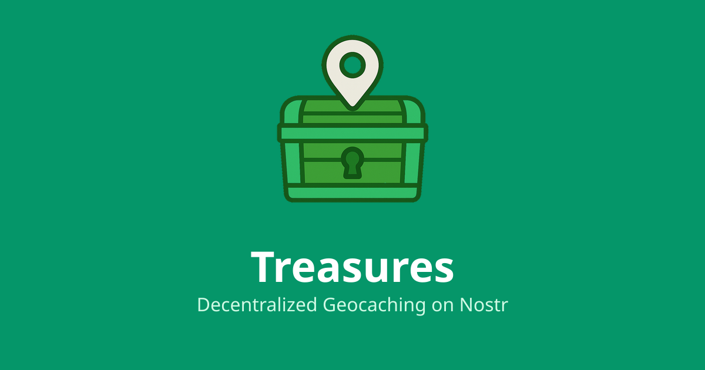

# Treasures

A decentralized geocaching platform built on the Nostr protocol. Discover hidden geocaches, share locations, and connect with explorers worldwide through a censorship-resistant, open network.

**Live at: [treasures.to](https://treasures.to)**



## Features

### Core Geocaching
- **Hide Geocaches**: Create and publish geocaches with GPS coordinates, descriptions, and difficulty ratings
- **Find Geocaches**: Discover geocaches hidden by other users around the world
- **Interactive Map**: Explore locations on a detailed map with custom markers and search functionality
- **Log Adventures**: Record your finds, DNFs (Did Not Find), and notes about each cache
- **Verification System**: QR code verification for cache finds with cryptographic proof

### Decentralized & Open
- **Nostr Protocol**: Built on the decentralized Nostr network - no central authority
- **Censorship Resistant**: Your geocaches and logs are stored across multiple relays
- **Open Source**: Fully open-source codebase with AGPL v3 license
- **No Registration**: Login with any Nostr keypair - no email or personal data required

### Advanced Features
- **Location Search**: Find geocaches by city, zip code, or "Near Me" functionality
- **Smart Filtering**: Filter by difficulty, terrain, cache type, and comparison operators
- **Proximity Search**: Geohash-based optimization for fast location queries
- **Distance Sorting**: Automatically sort results by proximity to your location
- **Responsive Design**: Optimized for both desktop and mobile devices
- **Progressive Web App**: Install as a native app on mobile devices
- **Image Support**: Upload and view images for geocaches with file hosting
- **Real-time Updates**: Automatic syncing across the Nostr network
- **Offline Support**: Cache data for offline viewing and sync when online


## Quick Start

### Prerequisites
- Node.js 18+ 
- npm or yarn

### Installation

1. **Clone the repository**
   ```bash
   git clone https://github.com/yourusername/treasures.git
   cd treasures
   ```

2. **Install dependencies**
   ```bash
   npm install
   ```

3. **Start development server**
   ```bash
   npm run dev
   ```

4. **Open your browser**
   Navigate to `http://localhost:5173`

### Building for Production

```bash
npm run build
npm run preview
```


## Technology Stack

### Frontend Framework
- **React 18** - Modern React with hooks and concurrent rendering
- **TypeScript** - Type-safe JavaScript development
- **Vite** - Fast build tool and development server

### Styling & UI
- **TailwindCSS 3** - Utility-first CSS framework
- **shadcn/ui** - Unstyled, accessible UI components built with Radix UI
- **Lucide React** - Beautiful, customizable icons
- **next-themes** - Dark/light theme support

### Nostr Integration
- **@nostrify/nostrify** - Nostr protocol framework for web
- **@nostrify/react** - React hooks and components for Nostr


### Data & State Management
- **TanStack Query** - Powerful data fetching, caching, and synchronization
- **React Router** - Declarative client-side routing
- **IndexedDB** - Offline storage for geocaches and events

### Maps & Location
- **Leaflet** - Open-source interactive maps
- **React Leaflet** - React components for Leaflet maps
- **OpenStreetMap** - Map tiles and location data
- **Geohash** - Spatial indexing for proximity queries

### Development & Build
- **ESLint** - Code linting and formatting
- **Vitest** - Fast unit testing framework
- **PWA Vite Plugin** - Progressive Web App features

## Project Structure

```
src/
├── components/          # Reusable UI components
│   ├── ui/             # shadcn/ui components (40+ components)
│   ├── auth/           # Authentication components
│   ├── form/           # Form input components
│   ├── layout/         # Layout components (PageLayout, etc.)
│   ├── common/         # Common components (LoadPage, etc.)
│   ├── GeocacheMap.tsx # Interactive map component
│   ├── GeocacheList.tsx # Cache listing component
│   ├── LocationPicker.tsx # Map-based location selection
│   ├── LocationWarnings.tsx # OSM verification warnings
│   └── VerificationQRDialog.tsx # QR code verification
├── hooks/              # Custom React hooks
│   ├── useNostr.ts     # Nostr protocol integration
│   ├── useGeocaches.ts # Geocache data fetching
│   ├── useOfflineGeocaches.ts # Offline-aware queries
│   ├── useForm.ts      # Generic form handling
│   ├── useAsyncOperation.ts # Async operation patterns
│   ├── useCurrentUser.ts # User authentication
│   └── useUploadFile.ts # File upload handling
├── pages/              # Route components
│   ├── Home.tsx        # Landing page with search
│   ├── Map.tsx         # Main map interface
│   ├── CreateCache.tsx # Create new geocache
│   ├── CacheDetail.tsx # Individual cache view
│   ├── MyCaches.tsx    # User's saved caches
│   ├── Profile.tsx     # User profile pages
│   ├── Settings.tsx    # App configuration
│   ├── Install.tsx     # PWA installation guide
│   └── Claim.tsx       # Cache verification
├── lib/                # Utility functions and constants
│   ├── nostrQuery.ts   # Unified Nostr query utilities
│   ├── constants.ts    # Application-wide constants
│   ├── coordinateUtils.ts # Geographic calculations
│   ├── cacheUtils.ts   # Browser cache utilities
│   ├── offlineStorage.ts # IndexedDB storage layer
│   ├── osmVerification.ts # OpenStreetMap location verification
│   ├── validation.ts   # Form validation utilities
│   ├── errorUtils.ts   # Error handling utilities
│   ├── geo.ts          # Geographic calculations
│   ├── nip-gc.ts       # Nostr geocaching protocol (NIP-GC)
│   ├── verification.ts # Cryptographic verification
│   └── utils.ts        # General utilities
└── types/              # TypeScript type definitions
    └── geocache.ts     # Geocache data types

scripts/                # Build scripts
public/                 # Static assets and PWA files
```

## How to Use

### Getting Started
1. **Open Treasures** at [treasures.to](https://treasures.to)
2. **Connect your Nostr account** using any NIP-07 compatible browser extension (like Alby, nos2x, or Flamingo)
3. **Explore the map** to find geocaches near you or search by location

### Finding Geocaches
- Use the **search bar** to find caches by name or location
- Click **"Near Me"** to find caches around your current location  
- **Filter results** by difficulty (D1-D5) and terrain (T1-T5) with comparison operators
- **Adjust search radius** from 5km to 100km
- Click on **map markers** or **list items** to view cache details

### Hiding Geocaches
1. Click **"Hide a Geocache"** or the **+** icon in navigation
2. Fill out cache details: name, description, difficulty, terrain
3. **Click on the map** to set GPS coordinates with OSM verification
4. Add optional **hint** and **images**
5. **Publish** your cache to the Nostr network
6. **Generate QR code** for physical verification

### Logging Finds
- Open any geocache detail page
- Choose log type: **Found It**, **Didn't Find It**, or **Write Note**
- Share your experience in the log text
- **Post your log** to help other cachers

### Verification System
- **Scan QR codes** at physical cache locations
- **Cryptographic proof** of cache visits
- **Verification keys** generated for each cache
- **Tamper-proof** verification records

## Nostr Integration

Treasures leverages the Nostr protocol for decentralized data storage:

### Event Types (NIP-GC)
- **Kind 37515**: Geocache listings (addressable events)
- **Kind 37516**: Geocache log entries
- **Kind 0**: User profile metadata
- **Kind 3**: Following relationships (for social features)

### Relays
The app uses **ditto.pub** as the primary Nostr relay:
- `wss://ditto.pub/relay` (primary relay)
- `wss://relay.damus.io` (fallback)
- `wss://nos.lol` (fallback)

Users can configure additional relays in Settings.

### Data Format
- **Geocaches**: Stored as addressable events with geohash tags for spatial indexing
- **Logs**: Reference parent geocaches with `a` tags
- **Verification**: Cryptographic signatures for cache visit proof
- **Images**: Uploaded to file hosting services with NIP-94 compatible metadata


## Development

### Code Architecture

The project follows modern React patterns with:

- **Unified Nostr queries** via `queryNostr()` utility
- **Generic form handling** with `useForm()` hook
- **Consistent loading states** with common components
- **Standardized layouts** with `PageLayout` component
- **Type-safe development** with comprehensive TypeScript types

### Testing

```bash
npm run test        # Run all tests (TypeScript, ESLint, Vitest, Build)
npm run lint        # Check code formatting
npm run type-check  # TypeScript type checking
```


## Progressive Web App

Treasures works as a Progressive Web App (PWA):

- **Offline Support**: Cache geocaches and events for offline viewing
- **Install Prompt**: Add to home screen on mobile devices
- **Background Sync**: Sync data when connection is restored
- **Service Worker**: Caches map tiles and app resources
- **Responsive Design**: Optimized for mobile and desktop

## Contributing

We welcome contributions! Please see our [Contributing Guide](CONTRIBUTING.md) for details.

### Development Workflow
1. Fork the repository
2. Create a feature branch (`git checkout -b feature/amazing-feature`)
3. Make your changes and test thoroughly (`npm run test`)
4. Commit with descriptive messages (`git commit -m 'Add amazing feature'`)
5. Push to your branch (`git push origin feature/amazing-feature`)
6. Open a Pull Request

### Code Standards
- **TypeScript**: All new code should be properly typed
- **Modern patterns**: Use existing utilities and hooks
- **Testing**: Include tests for new functionality
- **Documentation**: Update README and comments as needed

## License

This project is licensed under the GNU Affero General Public License v3.0 - see the [LICENSE](LICENSE) file for details.

## Acknowledgments

- **Nostr Protocol** - For providing the decentralized foundation
- **OpenStreetMap** - For high-quality, open map data
- **React Community** - For the amazing ecosystem and tools
- **Geocaching Community** - For inspiring this adventure platform
- **shadcn/ui** - For beautiful, accessible UI components

## Support

- **Issues**: [GitHub Issues](https://github.com/yourusername/treasures/issues)
- **Discussions**: [GitHub Discussions](https://github.com/yourusername/treasures/discussions)
- **Live Site**: [treasures.to](https://treasures.to)

---

**Start your adventure today!** Hide geocaches, find them, and explore the world through Treasures.